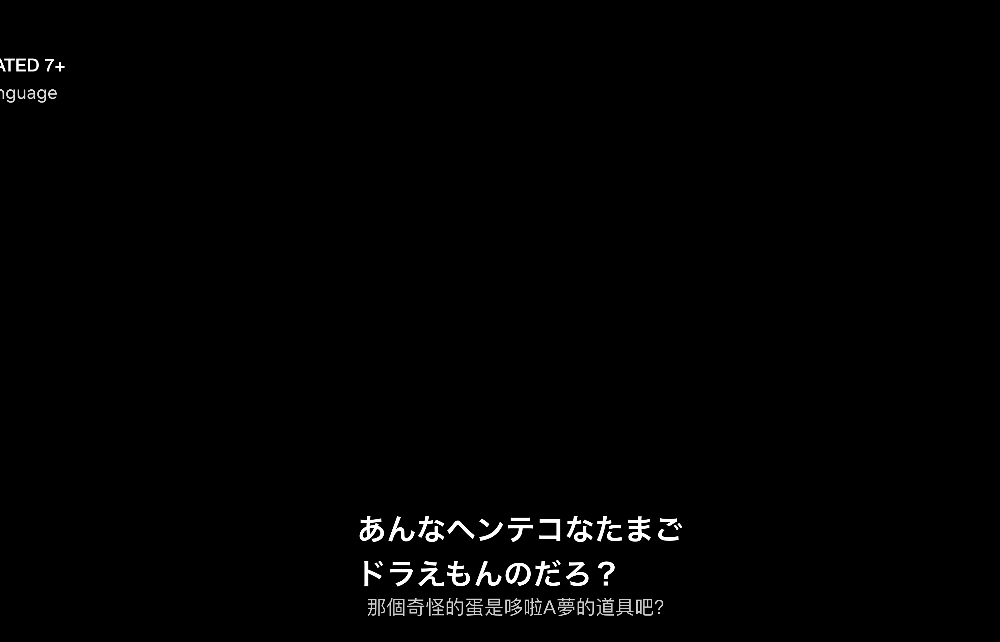
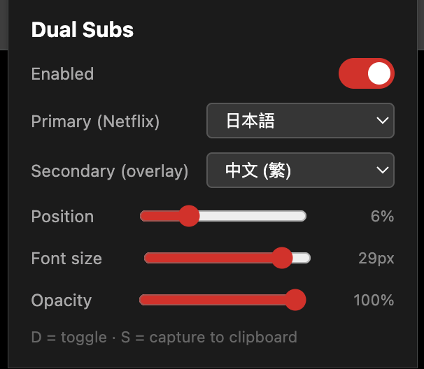

# Netflix Dual Subs

Chrome extension for **dual subtitles on Netflix** — show two languages at once (e.g. Japanese + Traditional Chinese). Built for language learners.

Defaults to Japanese (primary) + Traditional Chinese (secondary). Configurable via the extension popup — supports 30+ languages (JP, KO, ZH-Hant, ZH-Hans, EN, ES, FR, DE, IT, PT, RU, AR, HI, ID, TH, VI, TR, and more).

Any Netflix-supported language works — the code matches whatever language code Netflix serves, so adding more to the dropdown is a trivial edit in `popup.html`.

## Demo

Dual subtitles in action (Japanese primary + Traditional Chinese secondary):

Configure language pair, position, font size, and opacity from the popup:

## Features

- Dual subtitle overlay: primary (Netflix's native track) + secondary (fetched from Netflix's subtitle manifest)
- Works in fullscreen (overlay lives inside the player container)
- Adjustable position, font size, background opacity
- Keyboard shortcuts:
  - `D` — toggle overlay on/off
  - `S` — capture current line to clipboard
  - `E` — export all cues of current episode as `.txt`
- Text-format subtitles preferred over image-based tracks when available

## Install

Not published to the Chrome Web Store. Load unpacked:

1. Clone this repo
2. Open `chrome://extensions/`
3. Enable **Developer mode** (top right)
4. Click **Load unpacked** → select this folder
5. Open Netflix, start a video, use the extension popup to configure

## How it works

`intercept.js` hijacks `JSON.parse` on `netflix.com` to capture the subtitle manifest as Netflix's player requests it. The extension then fetches the secondary language track from the URLs in that manifest and renders it as an overlay synced to the video's `currentTime`.

No backend. No tracking. Runs entirely in your browser.

## License

MIT — see [LICENSE](LICENSE).

## Disclaimer

This extension is for **personal language-learning use only**. Users are responsible for complying with Netflix's Terms of Use in their jurisdiction. This project does not distribute, host, or redistribute any subtitle content or copyrighted material — it only reads subtitle data that Netflix already sends to your own browser session.

Not affiliated with Netflix, Inc. "Netflix" is a trademark of Netflix, Inc.
